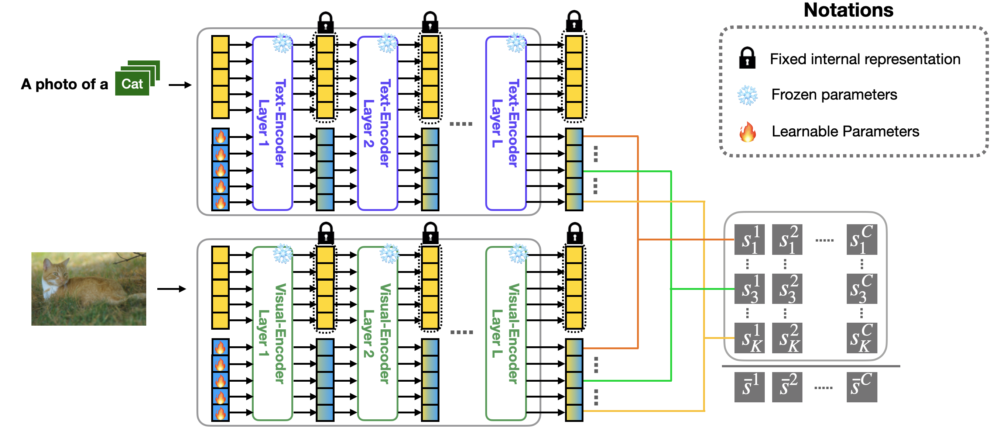

# Read-only-Prompt-Optimization for Vision-Language Few-shot Learning

This is the official implementation of the ICCV 2023 paper, "Read-only Prompt Optimization for Vision-Language Few-shot Learning" by D. Lee, S. Song, J. Suh, J. Choi, S. Lee and H. J. Kim.




## 1. Setup & Installations
1. install Dassl library following instruction from this [link](https://github.com/KaiyangZhou/Dassl.pytorch#installation) (For reproduction, cuda version 11.7 is recommended.)
2. Follow [DATASET.md](https://github.com/dongdori/Read-only-Prompt-Optimization/blob/main/DATASETS.md) to download datasets under ```data/``` directory.

## 2. How to Run Experiments?

### 2.1. Data path setup
For every ```base2new_train.sh```, ```base2new_test.sh```, ```xd_train.sh```, and ```xd_test.sh```  file in ```scripts/*/``` directory, uncomment ```DATA=``` and insert the current data directory (e.g., ```DATA=data/```) in the field.


### 2.2. Using Checkpoint
If you want to check reproducibility of Table1 and Table2, without multiple times of time-consuming training,
you may download ```rpo.zip``` file from this [link](https://drive.google.com/file/d/1LUEzIJ-_Nv7Le9NW8IIocYw_13uAzXq7/view?usp=share_link), unzip the file and place it under the ```output/``` directory.

### 2.3. Run Experiments
#### Table 1. Base to new generalization 

```
# Linear Probe
sh scripts/lp/base2new_generalization_main.sh [gpu_id]

# CoOp
sh scripts/coop/base2new_generalization_main.sh [gpu_id]

# CoCoOp
sh scripts/cocoop/base2new_generalization_main.sh [gpu_id]

# RPO
sh scripts/rpo/base2new_generalization_main.sh [gpu_id]
```

#### Table 2. Domain generalization
```
# CoOp
sh scripts/coop/domain_generalization_main.sh [gpu_id]

# CoCoOp
sh scripts/cocoop/domain_generalization_main.sh [gpu_id]

# RPO
sh scripts/rpo/domain_generalization_main.sh [gpu_id]
```

### Analyes & Figures

#### Figure 1.
```
# CoOp
sh scripts/coop/motivation.sh [gpu_id]

# CoCoOp
sh scripts/cocoop/motivation.sh [gpu_id]

# Linear Probe
sh scripts/lp/motivation.sh [gpu_id]
```


#### Table 4 & Figure 5
```
# RPO
sh scripts/rpo/efs_base2new_generalization_main.sh [gpu_id]

# CoCoOp
sh scripts/cocoop/efs_base2new_generalization_main.sh [gpu_id]
```

## Citation
```
@inproceedings{lee2023rpo,
  title={Read-only Prompt Optimization for Vision-Language Few-shot Learning},
  author={Lee, Dongjun and Song, Seokwon and Suh, Jihee and Choi, Joonmyeong and Lee, Sanghyeok and Kim, Hyunwoo J.},
  booktitle={Proceedings of the IEEE/CVF International Conference on Computer Vision (ICCV)},
  year={2023}
}
```

## License
Licensed under [MIT License](LICENSE)
* Copyright (c) 2022 MLV Lab (Machine Learning and Vision Lab at Korea University)